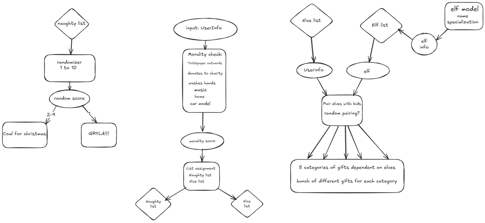

# Om dette prosjektet

Dette er et gruppeprosjekt vi fikk opp mot jul der vi skal lage et program som fordeler tilefeldig genererte personer inn i to lister (snill og slem) ut i fra egenskapene deres. Videre skal de på den snille listen få tildelt en alv og en gave basert på alvens egenskap, mens de slemme bare får kull (med en 10% sjanse for å bli spist av Gryla på julekvelden).

## Design

Diagrammet er laget av Oliver, som senere gikk over til en annen gruppe siden gruppen vår tydeligvis var for sterk

## Om Samarbeidet vårt

Vi hadde litt problemer med å få samkjørt oss i begynnelsen pga sykdom og lignende, men føler vi til slutt klarte å få noe lunde fordelt arbeidsoppgavene og samarbeidet. Vi har følt oppgaven var litt for liten til å få fordelt oppgavene godt nok, at vi jobber for mye oppi hverandre, som kan gi merge konflikter, så skulle gjerne hatt et litt større prosjekt neste gang (hint hint).

### Laget av

Steve - GruppeLeder, ansvarlig for deadlines, konfliktansvarlig
Joachim - Github-ansvarlig
Katrine - Ansvar for møtenotater
(delvis) Oliver - Designansvarlig
