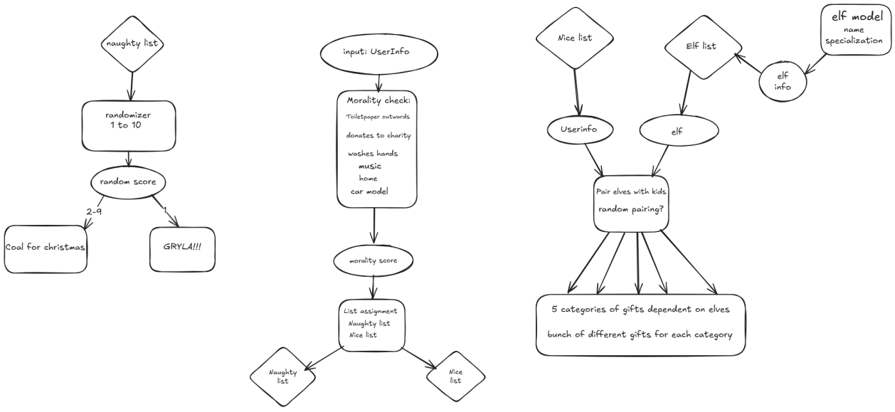
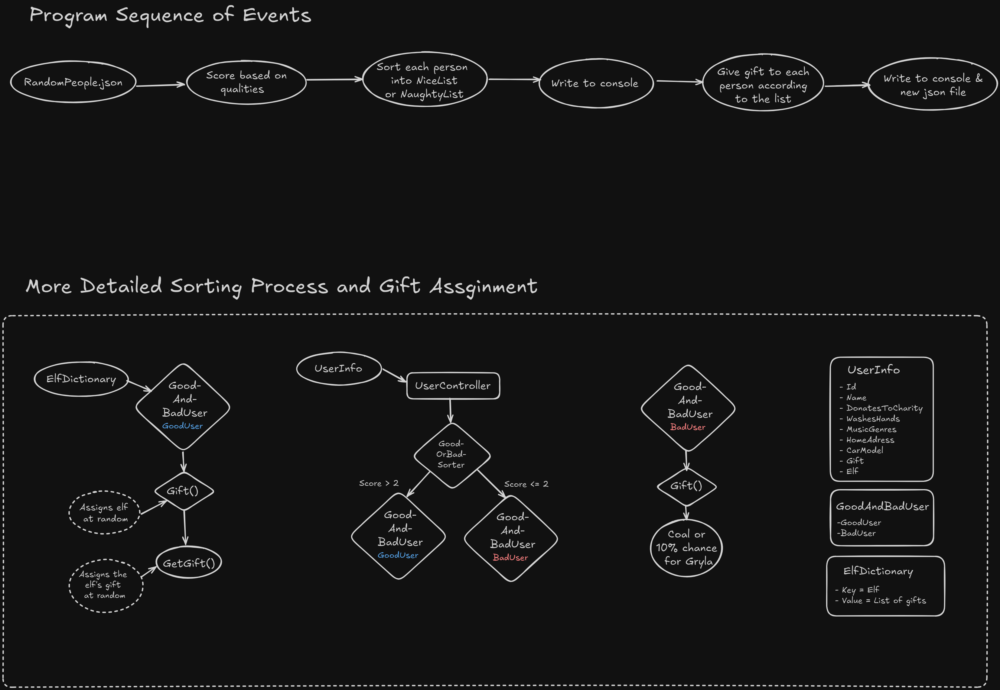

# Om dette prosjektet

Dette er et gruppeprosjekt vi fikk opp mot jul der vi skal lage et program som fordeler tilfeldig genererte personer inn i to lister (snill og slem) ut i fra egenskapene deres. Videre skal de på den snille listen få tildelt en alv og en gave basert på alvens egenskap, mens de slemme bare får kull (med en 10% sjanse for å bli spist av Gryla på julekvelden).

## Design

# Versjon 1

Diagrammet er laget av Oliver, som senere gikk over til en annen gruppe siden gruppen vår tydeligvis var for sterk

# Versjon 2

Nytt diagram laget og lagt til etter presentasjonen, laget av Katrine. Vi fikk beskjed om at vi burde legge til et oppdatert design siden vi gjorde noen endringer i hvordan vi har lagt opp koden og det gamle designet ikke lenger reflekterer hvordan koden er satt opp. Det nye diagrammet viser at vi gikk bort i fra å ha en modell for alver, og heller brukte en Dictionary.

Diagrammet har to deler:

- Den første delen er for å vise hvilke sekvens med steg programmet går gjennom.
- Den andre delen viser en litt mer detaljert sekvens med steg for kontrolleren, der den deler inn personer i lister og tildeler alver og gaver eller kull og Gryla.

## Om Samarbeidet vårt

Vi hadde litt problemer med å få samkjørt oss i begynnelsen pga sykdom og lignende, men føler vi til slutt klarte å få noe lunde fordelt arbeidsoppgavene og samarbeidet. Vi har følt oppgaven var litt for liten til å få fordelt oppgavene godt nok, at vi jobber for mye oppi hverandre, som kan gi merge konflikter, så skulle gjerne hatt et litt større prosjekt neste gang (hint hint).

### Laget av

- Steve - GruppeLeder, ansvarlig for deadlines, konfliktansvarlig
- Joachim - Github-ansvarlig
- Katrine - Ansvar for møtenotater
- (delvis) Oliver - Designansvarlig
